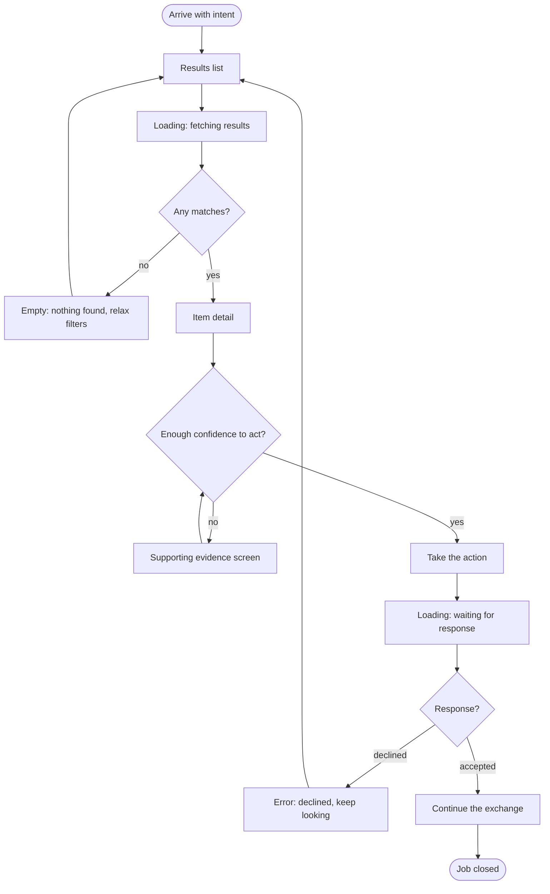

# Phase 3 — Structure (IA)

Every screen must serve a job. The **map** is derived from jobs; the **flows** walk that map and prove a person actually reaches an outcome. A screen with no job and a job with no screen are the same defect, caught by the same matrix.

## Prerequisites

- `people/personas.md` and `people/jtbd.md` exist. If missing → tell the user to run `/design:users` first and stop.
- `research/research.md` exists. If missing → `/design:research`.

## Load context

Read `.design/memory/constitution.md`, `.design/memory/toolbox.md`, and in full: `people/personas.md`, `people/jtbd.md`, `research/research.md`, and the brief in `CLAUDE.md`.

## Steps

### 1. Entity inventory — objects before screens

Do not design screens yet. Inventory the **entities** of the product: the main objects a person deals with in order to close their jobs.

For each entity:
- name;
- the fields and parts it contains;
- **which job produces it** — a reference to a specific job in `jtbd.md`;
- what it relates to (which entity references which).

An entity with no job goes into a **Questionable** section, not the main list. An object you are merely assuming gets `[?]`. Do not invent objects the jobs do not demand, and do not propose screens or navigation here.

Save as the **Entities** section of `ia/sitemap.md`.

### 2. Sitemap derived from jobs, not from a menu

From the entity inventory and the jobs, draft the screen hierarchy as an indented text tree.

**Do not copy a competitor's structure from `research.md`.** Derive screens from what a person is trying to do.

Rules:
- next to **every** screen, in parentheses, the job it serves (referencing `jtbd.md`). No job → it is an orphan: mark it `[ORPHAN]`;
- group by objects and by the person's logic, not by "site sections";
- mark separately which screens the primary persona needs and which are secondary;
- **do not confuse a screen with a state** — empty, error and loading are states of a screen, not screens.

Keep depth minimal for now; levels get added deliberately in step 3. Append as the **Screens** section of `ia/sitemap.md`.

### 3. Navigation model and tap-depth budget

The tree exists — do not invent a new one. Give it a movement model.

1. **Global navigation**: 3–5 items, each an entrance to a main job cluster, never "because everyone has it". State the job behind each item.
2. **Depth count**: how many taps from the first screen to the **main job** for the **primary persona**. If it is more than three, restructure and explain the trade-off. Write the count down — it is a budget that later phases are held to.
3. **Assign levels**: what is global (always visible), what is contextual (appears inside a flow), what is deep (rare actions).

Append as the **Navigation** section of `ia/sitemap.md`, including the tap count to the main job.

### 4. User flows in Mermaid

Write `ia/flows.md`: `flowchart TD` diagrams, each under a heading naming its job.

- the **main job** flow, complete;
- flows for **2–3 key related jobs** from `jtbd.md`.

Every flow must contain:
- steps as screen nodes `[in square brackets]`, named exactly as in `sitemap.md`;
- decision points as diamonds `{question?}` with labelled branches `-->|yes|` / `-->|no|`;
- **states as their own nodes**, not just the happy path: empty (nothing found), error (rejected or failed), loading (waiting);
- **both endings**: success *and* the dead ends where a person can get stuck.

Every screen node must exist in `sitemap.md`; if a new one appears, add it there and annotate its job. The Mermaid must be syntactically valid and render on GitHub: node text containing spaces or a colon goes in quotes `["..."]`. Under each diagram, list the decisions and states in words.

Shape reference:

````

````

### 5. Traceability matrix — jobs × screens

Rows: **all** jobs from `jtbd.md` (main, related, emotional, social). Columns: **all** screens from `sitemap.md`. Cell: `✓` if the screen genuinely takes part in closing that job, otherwise empty.

After the matrix, two explicit defect lists:

- **ORPHAN SCREENS** — columns with no `✓`: the screen exists, the job does not. Why does it exist?
- **ORPHAN JOBS** — rows with no `✓`: the job exists, the screen does not. Where is the person supposed to do this?

Both are defects, not "fine". For every orphan give a resolution: delete the screen, add a screen, attach it to an existing one, or push it to the backlog. Target: no empty row and no empty column.

Append as the **Traceability** section of `ia/sitemap.md`.

### 6. IA critique — four defect classes

Audit `ia/sitemap.md` and `ia/flows.md`. If the `impeccable` skill is active per `toolbox.md`, run its critique here too. Produce one table with columns **where / what / how to fix**, covering:

1. **DEAD ENDS** — flows where a person gets stuck with no exit: a "no" branch leading nowhere, an error or empty state with no way forward.
2. **MISSING STATES** — a happy path with no empty, error or loading.
3. **EXCESS DEPTH** — the main job or a frequent related job buried deeper than three taps for the primary persona.
4. **ORPHANS** — screens with no job and jobs with no screen. Reconcile against the existing traceability matrix; do not build a new one.

Order the table with dead ends and missing states first — they are the dangerous ones.

**Fix nothing silently.** Present the list first.

**HUMAN GATE — defect prioritization.** Stop. The user prioritizes. Then apply only the approved fixes, at the source: a structural defect is fixed in `sitemap.md` and propagated into `flows.md`, never patched in one diagram.

### 7. `ia/ia.html`

One clean page from the corrected `sitemap.md` and `flows.md`:
- the sitemap tree with the job printed next to every screen;
- all flows rendered as live Mermaid diagrams, initialized on the dark theme;
- the traceability matrix as a table, orphans highlighted.

Same dark, quiet styling as `research.html` and `personas.html`.

### 8. Run the phase checklist

Run `.design/checklists/phase-3-ia.md`. Hard items: every screen annotated with a job, tap depth to the main job ≤ 3 or an explicit documented trade-off, every flow has decision diamonds, all three states and both endings, Mermaid valid, no empty row or column left unresolved in the matrix, critique table produced and prioritized.

### 9. Living docs, dashboard, commit

- `CLAUDE.md` — append: the top-level sitemap, the main flow, the global navigation, and the tap depth to the main job.
- `README.md` — a **Structure** section: what lives in `sitemap.md` and `flows.md`.
- If building the IA exposed a data gap, extend `research/research.md` — it stays a living file.
- Regenerate `pipeline.html`; link `ia.html`.
- Commit: `feat: phase 3 — entities, sitemap, navigation, flows, traceability`. Push **only** if `toolbox.md` says GitHub hosting is active.

### 10. Sign-off

Report the top-level structure, the tap depth to the main job, the number of flows, and any orphan left deliberately open. Next command: `/design:wireframes`.

Then suggest, and run on approval:

```
git tag phase-3-ia
```

## Recovery prompts

```
This sitemap looks suspiciously like the menu of a well-known app. Walk every
screen and name the exact line in jtbd.md it closes. Where it only fits with a
stretch — that is an orphan, mark it [ORPHAN].
```

```
In this flow everything is found and everyone agrees. Add empty, error and
loading states, and show at least one "no" branch where a person can get stuck.
```

```
How many taps from the first screen to the main job for the primary persona?
If more than three — restructure and explain the trade-off.
```

```
Read every row and every column of the coverage matrix out loud: name the job
for each screen and the screen for each job. Where it is blank, that is an orphan.
```

```
The Mermaid does not render. Check flowchart syntax: quotes around nodes with
spaces, valid -->|label| arrows, no forbidden characters in node text.
```

```
You dropped the [ORPHAN] mark without a new job. Restore it or show the specific
job in jtbd.md that this screen closes.
```
