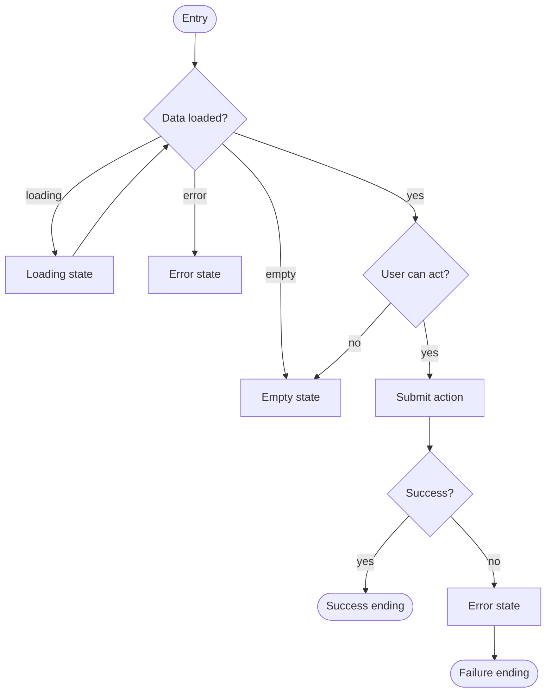
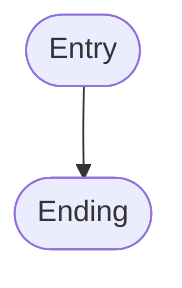

<!-- filled by /dsf:ia -->

# Flows

<!-- one Mermaid flow per main job. Every flow needs: decision diamonds,
     empty / error / loading states, and both a success and a failure ending. -->

## Flow — `[?]` (main job)

- Screens involved: `[?]`
- Source of the branching logic: `[?]`

## Flow — `[?]`

## Coverage

<!-- every flow traces back to a job in ia/sitemap.md -->

| Flow | Job | Screens | States covered |
|---|---|---|---|
| `[?]` | | | empty · error · loading · success · failure |
